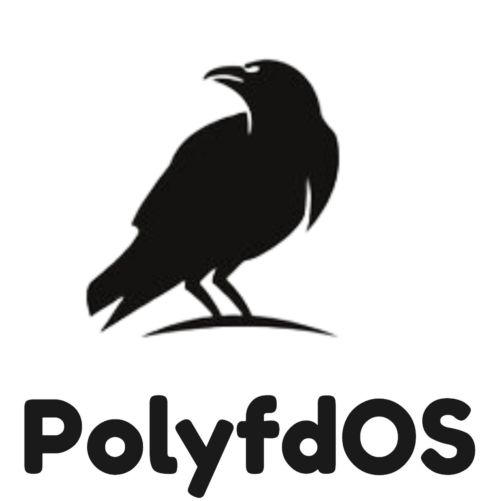

# polyfdOS 🇲🇦

<p align="center">
  
</p>

**A minimal x86 operating system built from scratch in Morocco**

polyfdOS is a bare-metal operating system kernel featuring custom bootloader implementation, protected mode initialization, hardware drivers, interrupt handling, and interactive shell capabilities. Built entirely from scratch using x86 Assembly and C, this project demonstrates low-level systems programming fundamentals.

---

##  Project Vision

polyfdOS represents the journey from high-level application development to bare-metal systems programming. This educational operating system serves as a foundation for understanding computer architecture, kernel development, and low-level hardware interaction.

**Organization:** Daftyon  
**Location:** Morocco 🇲🇦  
**Status:** Active Development

---

## ✨ Key Features

### Core System Components

- **Multiboot-compliant kernel** - ELF format compatible with GRUB bootloader
- **Protected Mode** - Full 32-bit protected mode with proper privilege levels
- **Memory Management** - Custom linker scripts and memory layout control
- **Hardware Abstraction** - Direct hardware access through port I/O operations

### System Tables & Descriptors

- **GDT (Global Descriptor Table)** - Memory segmentation and protection
- **IDT (Interrupt Descriptor Table)** - Hardware and software interrupt handling
- **PIC (Programmable Interrupt Controller)** - IRQ remapping and acknowledgment

### Hardware Drivers

- **Framebuffer Driver** - VGA text mode at 0xB8000
  - Character rendering with color attributes
  - Cursor positioning and control
  - Screen clearing and scrolling
  - Direct memory access for performance

- **Keyboard Driver** - PS/2 keyboard support (IRQ1)
  - Scan code to ASCII translation
  - US QWERTY layout
  - Interrupt-driven input handling

- **Serial Port Driver** - COM1 debugging output
  - Configurable baud rate
  - FIFO buffer management
  - Debug logging capabilities

### Interactive Shell

A minimal command-line interface with built-in commands:

```
help   - Display available commands
clear  - Clear the screen
echo   - Echo text back to terminal
about  - Display system information
play   - Launch Snake game
sudo   - Execute with elevated privileges
reboot - Restart the system
halt   - Shutdown the system
```

### Snake Game 🐍

A fully functional Snake game rendered through the framebuffer:
- **Controls:** WASD for movement, Q to quit
- **Features:** Collision detection, score tracking, progressive difficulty
- **Rendering:** Direct framebuffer manipulation for smooth gameplay

---

## 🏗️ Architecture

### Boot Sequence

```
BIOS → GRUB → Multiboot Header → loader.s → kmain()
```

1. **BIOS** initializes hardware and loads GRUB
2. **GRUB** loads the multiboot-compliant kernel
3. **loader.s** sets up protected mode and stack
4. **kmain.c** initializes drivers and starts shell

### Memory Layout

```
0x00000000 - 0x000003FF : Interrupt Vector Table (Real Mode)
0x00000400 - 0x000004FF : BIOS Data Area
0x000B8000 - 0x000B8FA0 : VGA Text Mode Buffer (80x25)
0x00100000+            : Kernel Code & Data
```

### Project Structure

```
polyfdOS/
├── loader.s              # Bootloader entry point (Assembly)
├── kmain.c               # Kernel main entry
├── link.ld               # Linker script
│
├── Drivers/
│   ├── fb.c/h            # Framebuffer driver
│   ├── keyboard.c/h      # PS/2 keyboard driver
│   ├── serial.c/h        # Serial port driver
│   ├── io.s/h            # Port I/O functions
│
├── System/
│   ├── gdt.c/h           # Global Descriptor Table
│   ├── gdt_asm.s         # GDT loader (Assembly)
│   ├── idt.c/h           # Interrupt Descriptor Table
│   ├── idt_asm.s         # IDT and interrupt stubs
│
├── Shell/
│   ├── shell.c/h         # Command interpreter
│   ├── snake.c/h         # Snake game implementation
│
├── Boot/
│   └── iso/
│       └── boot/
│           ├── grub/     # GRUB configuration
│           └── kernel.elf
│
└── Build/
    ├── Makefile          # Build automation
    ├── bochsrc.txt       # Bochs emulator config
    └── polyfdos.iso      # Bootable ISO image
```

---

## 🛠️ Building polyfdOS

### Prerequisites

**Linux/WSL2:**
```bash
sudo apt update
sudo apt install build-essential nasm grub-pc-bin genisoimage qemu-system-x86
```

**macOS:**
```bash
brew install nasm qemu xorriso grub i386-elf-gcc
```

### Compilation

```bash
# Clean previous builds
make clean

# Build kernel and ISO
make

# Build and run in QEMU
make run
```

### Build Output

- `kernel.elf` - The compiled kernel binary
- `polyfdos.iso` - Bootable ISO image (490KB)

---

## 🚀 Running polyfdOS

### QEMU (Recommended)

```bash
make run
# or manually:
qemu-system-i386 -cdrom polyfdos.iso
```

### Bochs

```bash
bochs -f bochsrc.txt -q
```

### VirtualBox / VMware

1. Create a new VM (Other/32-bit)
2. Attach `polyfdos.iso` as CD-ROM
3. Boot from CD-ROM

### Real Hardware (Advanced)

```bash
# Burn to USB drive (⚠️ DESTROYS ALL DATA ON /dev/sdX)
sudo dd if=polyfdos.iso of=/dev/sdX bs=4M status=progress
```

---

## 🎮 Usage Examples

### Basic Commands

```bash
> help
Available commands:
  help   - Display this help message
  clear  - Clear the screen
  ...

> echo Hello from Morocco!
Hello from Morocco!

> about
polyfdOS v1.3 - Moroccan x86 Operating System
...
```

### Snake Game

```bash
> play
[Snake game launches]
Use WASD to move, Q to quit
```

### System Management

```bash
> sudo install awesome-package
[sudo] password for synthos:
Authenticating...
Access granted! You are now root.

> reboot
Rebooting polyfdOS...
Goodbye!
[System reboots]
```

---

## 📚 Technical Deep Dive

### Interrupt Handling

polyfdOS implements a complete interrupt handling system:

```c
// 48 interrupt handlers (0-47)
// IRQ remapping: PIC1 → 0x20-0x27, PIC2 → 0x28-0x2F
// Keyboard interrupt: IRQ1 → INT 0x21 (33)
```

### Memory Management

Currently uses flat memory model with segmentation:
- Code Segment: Base 0x00000000, Limit 0xFFFFFFFF
- Data Segment: Base 0x00000000, Limit 0xFFFFFFFF

### Calling Conventions

Follows System V ABI for i386:
- Arguments pushed right-to-left on stack
- Caller cleans up stack
- Return value in EAX

---

## 🗺️ Roadmap

### Phase 1: Foundation ✅ (Complete)
- [x] Bootloader and protected mode
- [x] GDT and IDT setup
- [x] Basic drivers (framebuffer, keyboard, serial)
- [x] Interactive shell
- [x] Snake game

### Phase 2: Memory Management (In Progress)
- [ ] Physical memory manager (bitmap allocator)
- [ ] Virtual memory (paging)
- [ ] Heap allocator (kmalloc/kfree)
- [ ] Memory protection

### Phase 3: Process Management
- [ ] Task switching and scheduler
- [ ] Process creation/termination
- [ ] Context switching
- [ ] System calls interface

### Phase 4: File System
- [ ] VFS (Virtual File System) layer
- [ ] FAT32 implementation
- [ ] File operations (open, read, write, close)
- [ ] Directory support

### Phase 5: Advanced Features
- [ ] Multi-core support
- [ ] Network stack (basic TCP/IP)
- [ ] Device drivers (ATA, USB)
- [ ] User space programs
- [ ] ELF loader

---

## 🤝 Contributing

Contributions are welcome! This is an educational project designed to help developers learn OS development.

### How to Contribute

1. **Fork** the repository
2. **Create** a feature branch (`git checkout -b feature/amazing-feature`)
3. **Commit** your changes (`git commit -m 'Add amazing feature'`)
4. **Push** to the branch (`git push origin feature/amazing-feature`)
5. **Open** a Pull Request

### Contribution Guidelines

- Follow existing code style and conventions
- Add comments for complex logic
- Test on both QEMU and Bochs
- Update documentation for new features
- Keep commits atomic and well-described

### Areas for Contribution

- 🐛 Bug fixes and stability improvements
- 📝 Documentation and tutorials
- ⚡ Performance optimizations
- 🎨 New shell commands
- 🔧 Additional drivers
- 🧪 Testing and validation

---

## 📖 Learning Resources

polyfdOS was built using knowledge from:

- **[The Little Book About OS Development](https://littleosbook.github.io/book.pdf)** - Core OS concepts
- **[OSDev Wiki](https://wiki.osdev.org/)** - Comprehensive technical reference
- **[Intel 64 and IA-32 Architectures Software Developer Manuals](https://www.intel.com/content/www/us/en/developer/articles/technical/intel-sdm.html)** - x86 architecture
- **[GRUB Documentation](https://www.gnu.org/software/grub/manual/)** - Bootloader specification

---

## 📝 License

This project is open source and available under the MIT License.

```
MIT License

Copyright (c) 2024 Daftyon

Permission is hereby granted, free of charge, to any person obtaining a copy
of this software and associated documentation files (the "Software"), to deal
in the Software without restriction, including without limitation the rights
to use, copy, modify, merge, publish, distribute, sublicense, and/or sell
copies of the Software, and to permit persons to whom the Software is
furnished to do so, subject to the following conditions:

The above copyright notice and this permission notice shall be included in all
copies or substantial portions of the Software.

THE SOFTWARE IS PROVIDED "AS IS", WITHOUT WARRANTY OF ANY KIND, EXPRESS OR
IMPLIED, INCLUDING BUT NOT LIMITED TO THE WARRANTIES OF MERCHANTABILITY,
FITNESS FOR A PARTICULAR PURPOSE AND NONINFRINGEMENT. IN NO EVENT SHALL THE
AUTHORS OR COPYRIGHT HOLDERS BE LIABLE FOR ANY CLAIM, DAMAGES OR OTHER
LIABILITY, WHETHER IN AN ACTION OF CONTRACT, TORT OR OTHERWISE, ARISING FROM,
OUT OF OR IN CONNECTION WITH THE SOFTWARE OR THE USE OR OTHER DEALINGS IN THE
SOFTWARE.
```

---

## 🔧 Troubleshooting

### Build Issues

**Error: `nasm: command not found`**
```bash
sudo apt install nasm
```

**Error: `genisoimage: command not found`**
```bash
sudo apt install genisoimage
```

### Runtime Issues

**QEMU won't start**
```bash
# Check if ISO was created
ls -lh polyfdos.iso

# Try with more verbose output
qemu-system-i386 -cdrom polyfdos.iso -serial stdio
```

**Keyboard not responding**
- Ensure QEMU window has focus
- Try clicking inside the QEMU window
- Check if interrupts are enabled (they should be)

---

## 📊 Statistics

- **Lines of Code:** ~2,000+
- **Binary Size:** 26 KB (kernel.elf)
- **ISO Size:** 490 KB
- **Boot Time:** < 1 second in QEMU
- **Languages:** C (70%), Assembly (30%)

---

## 🌟 Acknowledgments

Special thanks to:
- The OSDev community for extensive documentation
- QEMU and Bochs developers for excellent emulation tools
- GRUB developers for a robust bootloader
- The Moroccan tech community for support and inspiration

---

**polyfdOS** - A Moroccan x86 Operating System Built from Scratch

*Making low-level programming accessible, one kernel at a time* 🇲🇦

**Organization:** Daftyon
